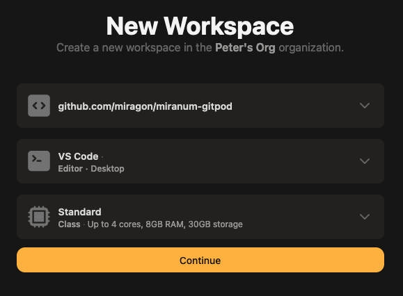
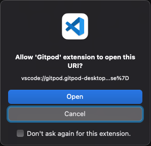
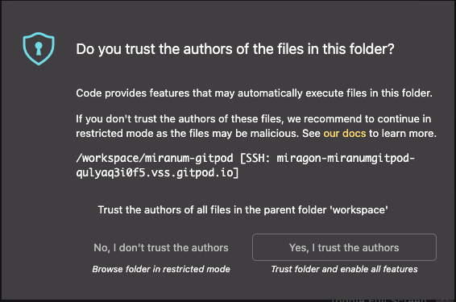
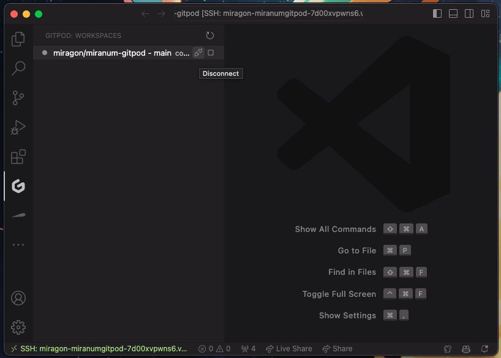
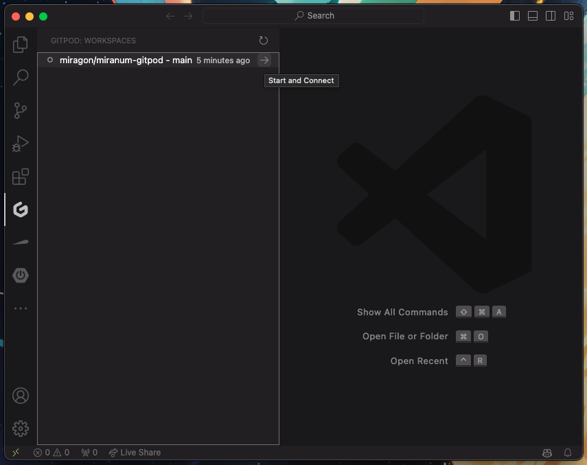

<div id="top"></div>

## About The Project

This template can act as a starting point for your own **Miranum IDE x Gitpod** Project.

**Miranum IDE** is a collection of Visual Studio Code Plugins for simplifying the development of process applications with Camunda.
**Gitpod** is a cloud development environment for teams to efficiently and securely develop software.

## Quickstart

1. [Checklist](#checklist)
2. [Create Remote Workspace](#create-a-remote-workspace)
3. [Reconnect to a Workspace](#reconnect-to-the-workspace-via-vs-code)

### Checklist

- [ ] Visual Studio Code (Version > 1.76.0) is installed
- [ ] The following plugins are installed
   - [ ] [Gitpod](https://marketplace.visualstudio.com/items?itemName=gitpod.gitpod-desktop)
   - [ ] [Gitpod Remote](https://marketplace.visualstudio.com/items?itemName=gitpod.gitpod-remote-ssh)
   - [ ] [Remote - SSH](https://marketplace.visualstudio.com/items?itemName=ms-vscode-remote.remote-ssh)
- [ ] You have a [Gitpod Account](https://gitpod.io)
- [ ] You are logged in to Gitpod in VS Code (see [VS Code Desktop](https://www.gitpod.io/docs/references/ides-and-editors/vscode))
- [ ] You have granted Gitpod access to your GitHub account (see [Push to GitHub via Gitpod](#push-to-github-via-gitpod))

#### Push to GitHub via Gitpod

1. Go to your [User Settings](https://gitpod.io/access-control)
2. Click the three dots on the right side of the line that says `GitHub`
3. Click `Edit Permissions`
4. Grant the permissions to your need (e.g. `public_repo` to allow *write access* to your public repositories)

### Create a remote workspace

1. Open a **Workspace** by prefixing the URL with `gitpod.io/#` (e.g. `gitpod.io/#https://github.com/miragon/miranum-gitpod-template`)

2. Configure Workspace Options

   

3. Navigate through the different popups in VS Code

   |                                 Allow `Gitpod` to open URL                                  |                            Trust Author                             |
   |:-------------------------------------------------------------------------------------------:|:-------------------------------------------------------------------:|
   |  |  |

4. Enable `Gitdoc`
   1. Open the Command Palette (`Ctrl+Shift+P` or `View > Command Palette...`)
   2. Type `Gitdoc: Enable`

5. Disconnect from the Workspace

   

### Reconnect to the workspace via VS Code



## Tips and Tricks

### Add Gitpod to your trusted domains in VS Code

1. Open the Command Palette (Ctrl+Shift+P)
2. Type `Manage Trusted Domains`
3. Add `"https://gitpod.io"` to the list of trusted domains at the end of the file
   ```json
   [
      "https://gitpod.io"
   ]  
   ```

### Install Gitpod Browser Extension
* [Chrome](https://chrome.google.com/webstore/detail/gitpod-online-ide/dodmmooeoklaejobgleioelladacbeki)
* [Firefox](https://addons.mozilla.org/en-US/firefox/addon/gitpod/)

<p align="right">(<a href="#top">back to top</a>)</p>
